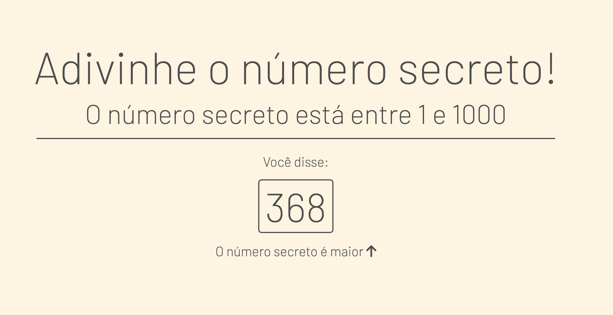

# Adivinhe o número secreto!
O projeto é uma página simples feita com HTML, CSS e JavaScript.

O usuário deve adivinhar o número entre 1 e 1000, por meio de uma entrada de áudio. A Web Speech API é quem cuida da parte de reconhecimento de fala.
O programa auxilia o usuário, indicando se o número falado é maior ou menor do que o número secreto
- Importante: utilizar Google Chrome pois fornece suporte à interface.

